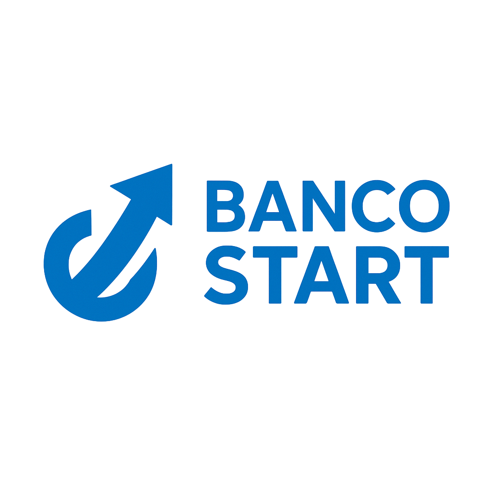

  
  <h1>🏦 Infraestrutura de Rede Corporativa</h1>
  <h3>Projeto Banco Start</h3>
  
  

    
    
  

 
Projeto de design e implementação de rede WAN/LAN para uma Fintech em expansão nacional, conectando Sede (SP) e Filiais (RJ/BSB).

## 📋 Sobre o Projeto
Este projeto simula a infraestrutura de rede de uma instituição financeira ("Banco Start") em processo de expansão. O objetivo foi criar uma rede segura, segmentada e escalável, conectando a Matriz em São Paulo a duas novas filiais (Rio de Janeiro e Brasília) através de uma conexão WAN Frame Relay simulada.

A arquitetura foi projetada para suportar serviços críticos (Financeiro) e operacionais com total isolamento de tráfego via VLANs e centralização de serviços de TI.

## 🛠️ Tecnologias e Protocolos Utilizados
### Simulação: Cisco Packet Tracer 8.2

 Routing: Router-on-a-Stick (Inter-VLAN), Roteamento Estático, Encapsulamento 802.1Q.

 Switching: VLANs, Trunking (802.1Q), VTP.

 WAN: Frame Relay (Hub-and-Spoke), Conexões Seriais (HWIC-2T).

### Serviços de Rede:

 DHCP Relay: Centralizado na Sede com distribuição via WAN.

 DNS & HTTP: Servidor de Intranet e resolução de nomes.

 Endereçamento: IPv4 com VLSM (Variable Length Subnet Mask) para otimização de IPs (/24 na Sede, /26 nas Filiais).

## 📍 Arquitetura da Rede
### 🏢 Sede - São Paulo (Core Site)
Topologia: Hierárquica (Core/Acesso) com Switch Multilayer L3.

 Segmentação: 6 VLANs (Tecnologia, RH, Comercial, Financeiro, Adm, Servidores).

 Hardware: Cisco 1941 (Router), Catalyst 3560 (Core), Catalyst 2960 (Acesso).

### 🏢 Filiais - Rio de Janeiro e Brasília (Remote Sites)
 Topologia: Collapsed Core.

 Segmentação: 4 VLANs Locais.

 Serviços: Operam sem servidores locais, consumindo recursos da Sede via DHCP Relay.

## 📸 Topologia (Screenshots)

| 1. Visão Geral da Rede (WAN + Filiais) |
| :---: |
|  |

 

| 2. Detalhe da Sede (São Paulo - Core Site) |
| :---: |
|  |

 

| 3. Detalhe das Filiais (Rio de Janeiro e Brasília) |
| :---: |
|  |

## 🚀 Como Executar
Tenha o Cisco Packet Tracer instalado (versão 8.0 ou superior).

Clone este repositório.

Abra o arquivo Banco_Start.pkt.

Aguarde a convergência da rede (luzes verdes).

Teste a conectividade acessando a URL banco.start.com a partir de qualquer PC das filiais.

Faça um teste de ping para verificar a conexão entre as estações de trabalho

## 📄 Documentação
A documentação técnica completa, incluindo tabelas de roteamento e plano de endereçamento, está disponível [Clicando Aqui](https://drive.google.com/drive/folders/1RlXlj8bdvpXnoHlAzA7IAt7XXZPbwdnV?usp=drive_link).

Autores: [Kauann Dos Santos Silva](https://www.linkedin.com/in/kauann-santos-931740242/), [Arthur de Assis Matos](https://www.linkedin.com/in/arthur-matos-108713295/), [Guilherme César Moreira](https://br.linkedin.com/in/guilherme-cesar-moreira-8b7b59361), [Vinícius Lamim Garcia](https://www.linkedin.com/in/vinícius-lamim-39583b217?utm_source=share_via&utm_content=profile&utm_medium=member_ios), [Daniel do Nascimento Silva] e [Joel Kendi Arie Ferreira](https://www.linkedin.com/in/joel-kendi-arie-ferreira-51601537a/?utm_source=share&utm_campaign=share_via&utm_content=profile&utm_medium=android_app)

